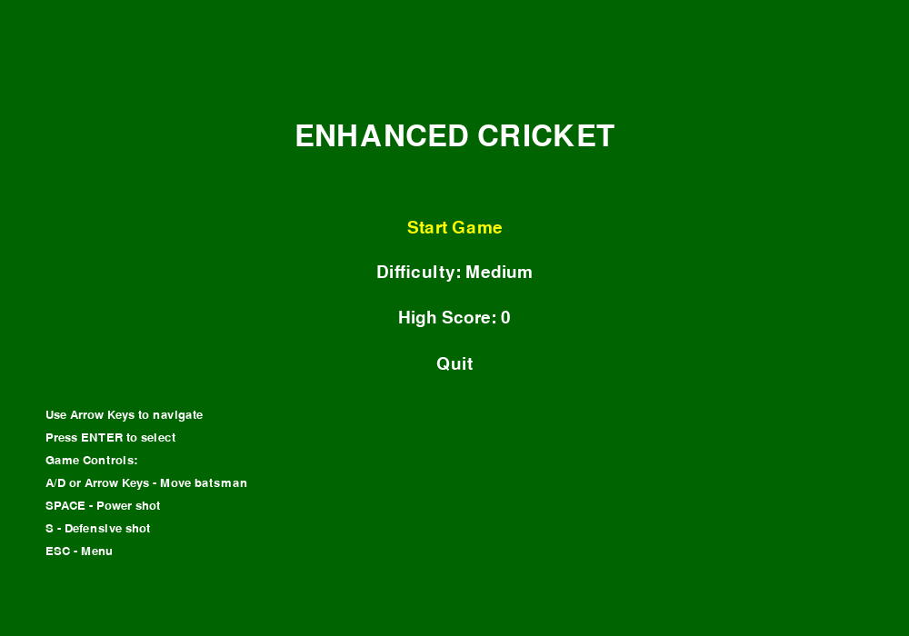
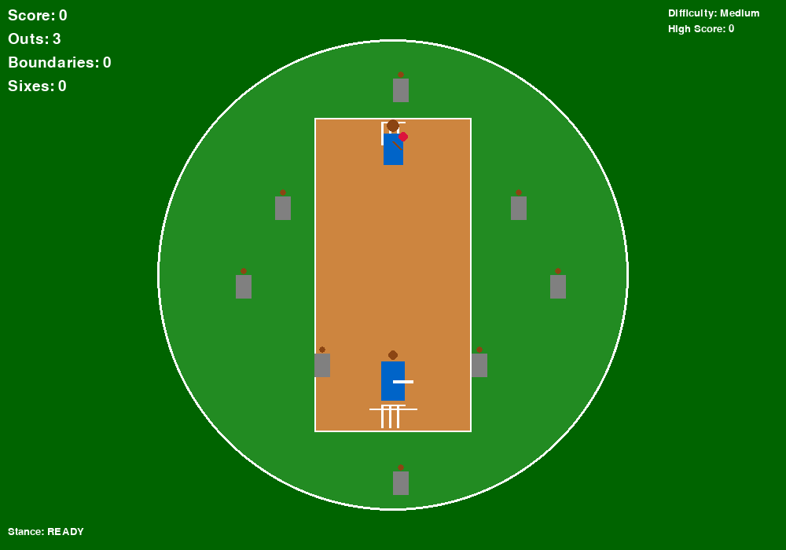
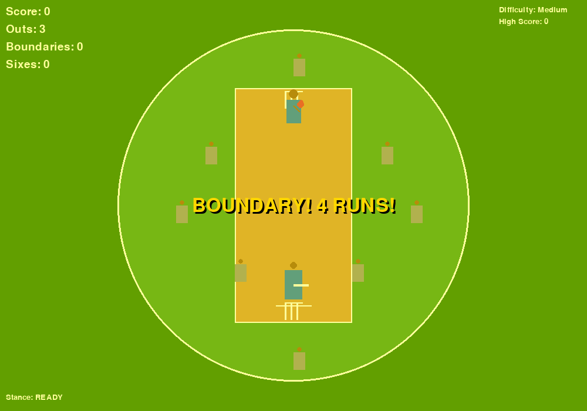
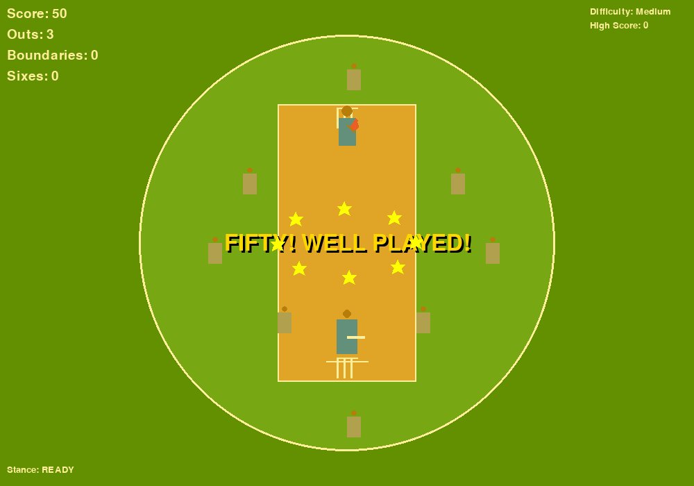
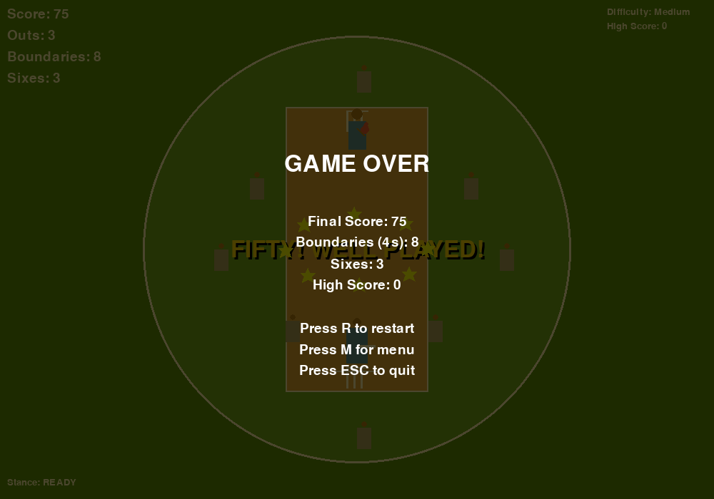

# 🏏 Enhanced Retro Cricket Game

[](https://python.org)
[](https://pygame.org)
[](LICENSE)
[]()

A comprehensive cricket batting simulation with realistic gameplay mechanics, humanized characters, and stadium environment.



## 🎮 Quick Start

```bash
# Clone the repository
git clone https://github.com/yourusername/enhanced-retro-cricket.git
cd enhanced-retro-cricket

# Install dependencies
pip install -r requirements.txt

# Run the game
python src/enhanced_cricket.py
```

## 📸 Screenshots

<table>
  <tr>
    <td align="center">
      
      <br><b>Active Gameplay</b>
    </td>
    <td align="center">
      
      <br><b>Boundary Celebration</b>
    </td>
  </tr>
  <tr>
    <td align="center">
      
      <br><b>Milestone Achievement</b>
    </td>
    <td align="center">
      
      <br><b>Game Over Screen</b>
    </td>
  </tr>
</table>

## 🏏 Features

### Core Gameplay
- **Realistic Batting**: Multiple batting stances (Ready, Swing, Defensive)
- **Physics-Based Ball Movement**: Realistic ball trajectories and bouncing
- **Collision Detection**: Precise bat-ball interaction with directional hitting
- **Scoring System**: Points for hits, boundaries, and combo multipliers

### Characters & Environment
- **Humanized Batsman**: Animated character with different stances and movements
- **Realistic Bowler**: Animated bowling action with proper timing
- **8 Fielders**: Positioned around the field with AI movement
- **Stadium Environment**: Circular boundary, proper cricket pitch, stumps, and crease lines

### Advanced Features
- **3 Difficulty Levels**: Easy, Medium, Hard (affects ball speed and accuracy)
- **Power-Up System**: Special balls (Fast, Slow, Curve) with visual indicators
- **Combo System**: Score multipliers for consecutive hits
- **High Score Tracking**: Persistent high score system
- **Sound Effects**: Generated audio for hits, wickets, boundaries, and milestones
- **Celebration System**: Special animations for boundaries, sixes, and scoring milestones
- **Milestone Achievements**: Celebrations for 50, 100, and 150 runs

### Game Mechanics
- **Outs System**: Start with 3 outs, lose one for each missed ball
- **Boundary Scoring**: 4 points for hitting the boundary
- **Six Scoring**: 6 points for hitting the ball over the boundary
- **Stance-Based Scoring**: Different points for different batting styles
- **Ball Trail Effects**: Visual feedback for ball movement
- **Fielder AI**: Fielders move toward the ball when hit, reset after each delivery
- **Automatic Fielder Reset**: All fielders return to original positions after each ball

## 🎮 Controls

### Menu Navigation
- **Arrow Keys**: Navigate menu options
- **Enter**: Select menu option
- **ESC**: Return to menu from game

### Batting Controls
- **A/D or Arrow Keys**: Move batsman left/right
- **SPACE**: Power shot (aggressive batting)
- **S**: Defensive shot (safer batting)
- **ESC**: Return to menu
- **P**: Pause game (if implemented)

### Game Over
- **R**: Restart game
- **M**: Return to main menu
- **ESC**: Quit game

## 🏆 Scoring System

### Points
- **Regular Hit**: 1 point
- **Power Shot Hit**: 2 points
- **Defensive Hit**: 1 point
- **Boundary**: 4 points
- **Six**: 6 points

### Combo Multipliers
- **3+ consecutive hits**: 2x multiplier
- **5+ consecutive hits**: 3x multiplier
- **Miss a ball**: Reset combo

### Difficulty Levels
- **Easy**: Slower balls, longer spawn delay, higher accuracy
- **Medium**: Moderate speed and timing
- **Hard**: Fast balls, quick spawning, challenging accuracy

## 🎵 Audio Features
- **Hit Sounds**: Satisfying "thwack" when bat connects
- **Wicket Sounds**: Descending tone for missed balls
- **Boundary Sounds**: Celebratory ascending tones
- **Power-up Sounds**: Special audio for power-up balls
- **Milestone Fanfares**: Special celebration sounds for 50, 100, and 150 runs

## 🎨 Visual Features
- **Stadium Design**: Realistic cricket ground with boundaries
- **Character Animation**: Smooth movement and stance changes
- **Ball Trail Effects**: Visual feedback for ball movement
- **Power-up Indicators**: Special visual effects for special balls
- **UI Elements**: Clean, informative interface

## 🚀 Technical Features
- **60 FPS Gameplay**: Smooth animation and responsive controls
- **Modular Code Structure**: Clean, maintainable codebase
- **Error Handling**: Graceful fallbacks for missing dependencies
- **Cross-platform**: Works on Windows, Mac, and Linux

## 📋 Requirements
- Python 3.6+
- Pygame 2.0+
- NumPy (optional, for sound effects)

## 🎯 Game Objectives
1. **Survive**: Don't lose all 3 outs
2. **Score High**: Hit as many balls as possible
3. **Build Combos**: Consecutive hits for higher scores
4. **Hit Boundaries**: Aim for the boundary for 4 points
5. **Beat High Score**: Challenge yourself to improve

## 🏏 Cricket Realism
- **Proper Field Setup**: Authentic fielding positions
- **Realistic Physics**: Ball bounces and trajectories
- **Cricket Terminology**: Wickets, boundaries, outs
- **Stadium Atmosphere**: Circular boundary, pitch markings
- **Batting Techniques**: Different stances affect gameplay

## 🎮 Tips for Success
1. **Time Your Shots**: Wait for the right moment to swing
2. **Use Different Stances**: Power shots for boundaries, defensive for safety
3. **Watch the Ball**: Special balls have different behaviors
4. **Build Combos**: Consecutive hits multiply your score
5. **Practice Movement**: Position yourself for optimal hits

Enjoy your enhanced cricket experience! 🏏✨

## 📚 Documentation

- **[Installation Guide](INSTALL.md)** - Detailed setup instructions for all platforms
- **[Technology Stack](docs/TECH_STACK.md)** - Complete technical documentation
- **[Project Structure](PROJECT_STRUCTURE.md)** - File organization and architecture

## 🚀 Installation

See [INSTALL.md](INSTALL.md) for detailed installation instructions.

## 🛠️ Technology Stack

See [docs/TECH_STACK.md](docs/TECH_STACK.md) for complete technical details.

**Core Technologies:**
- **Python 3.6+** - Cross-platform programming language
- **Pygame 2.0+** - 2D graphics and game engine
- **NumPy 1.19+** - Audio processing and mathematical operations

## 🤝 Contributing

We welcome contributions! Please feel free to submit a Pull Request.

1. Fork the repository
2. Create your feature branch (`git checkout -b feature/AmazingFeature`)
3. Commit your changes (`git commit -m 'Add some AmazingFeature'`)
4. Push to the branch (`git push origin feature/AmazingFeature`)
5. Open a Pull Request

## 📄 License

This project is licensed under the MIT License - see the [LICENSE](LICENSE) file for details.

## 🙏 Acknowledgments

- Pygame community for the excellent game development framework
- NumPy team for mathematical computing capabilities
- Cricket enthusiasts who inspired this project

## 📞 Support

If you encounter any issues or have questions:
- Open an [Issue](https://github.com/yourusername/enhanced-retro-cricket/issues)
- Check the [Installation Guide](INSTALL.md)
- Review the [Technology Stack](docs/TECH_STACK.md)

---

<div align="center">
  <b>🏏 Made with ❤️ for Cricket Fans 🏏</b>
  <br>
  <i>Star ⭐ this repository if you enjoyed the game!</i>
</div>
